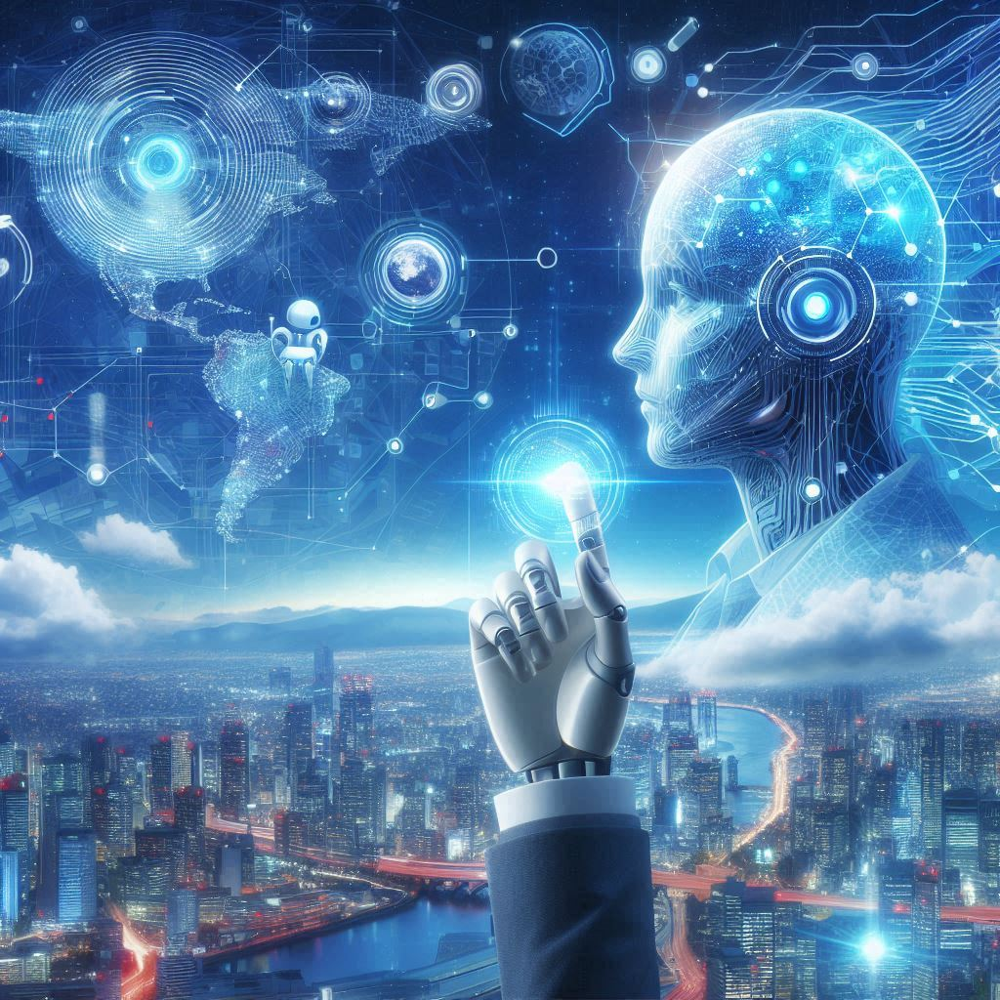
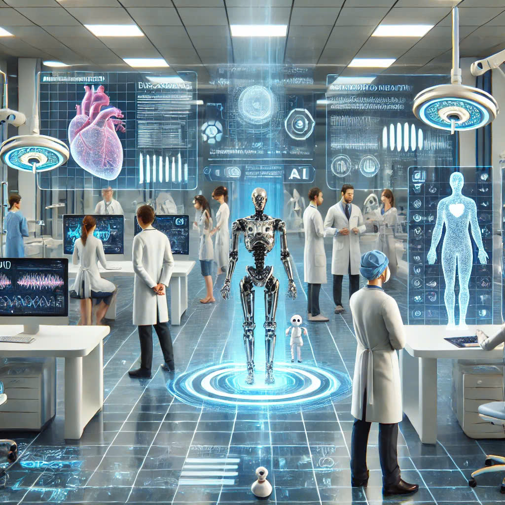
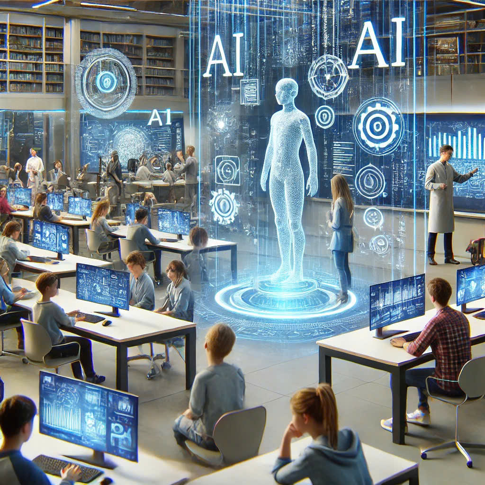
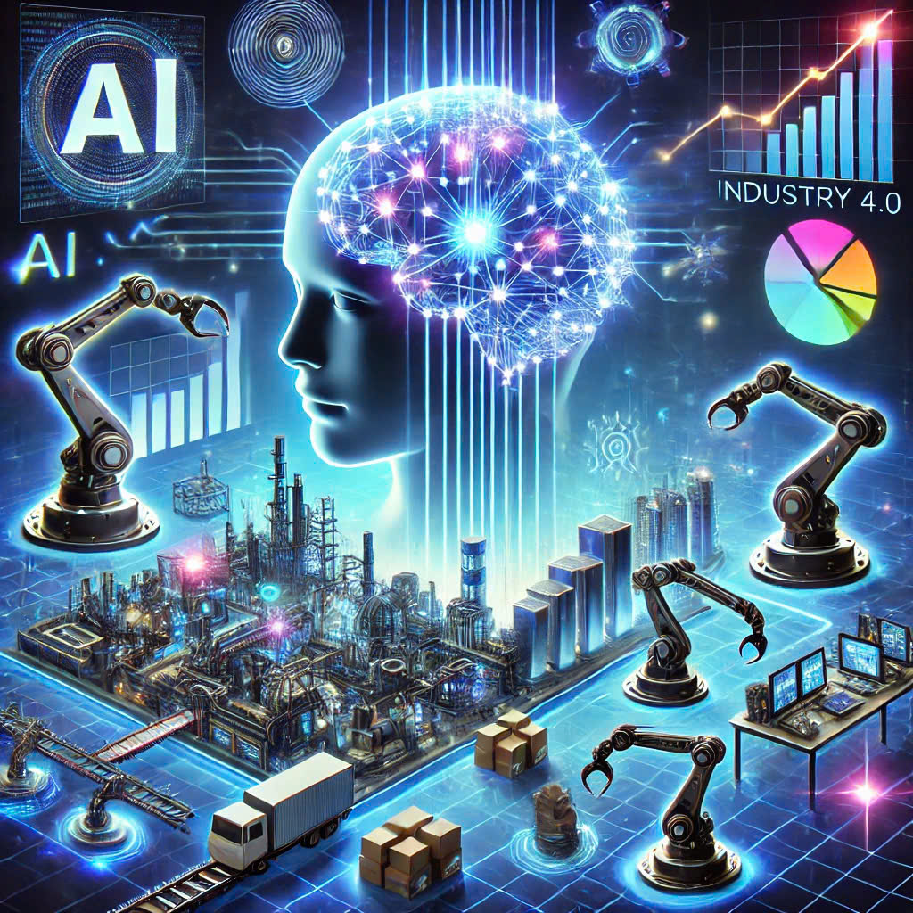
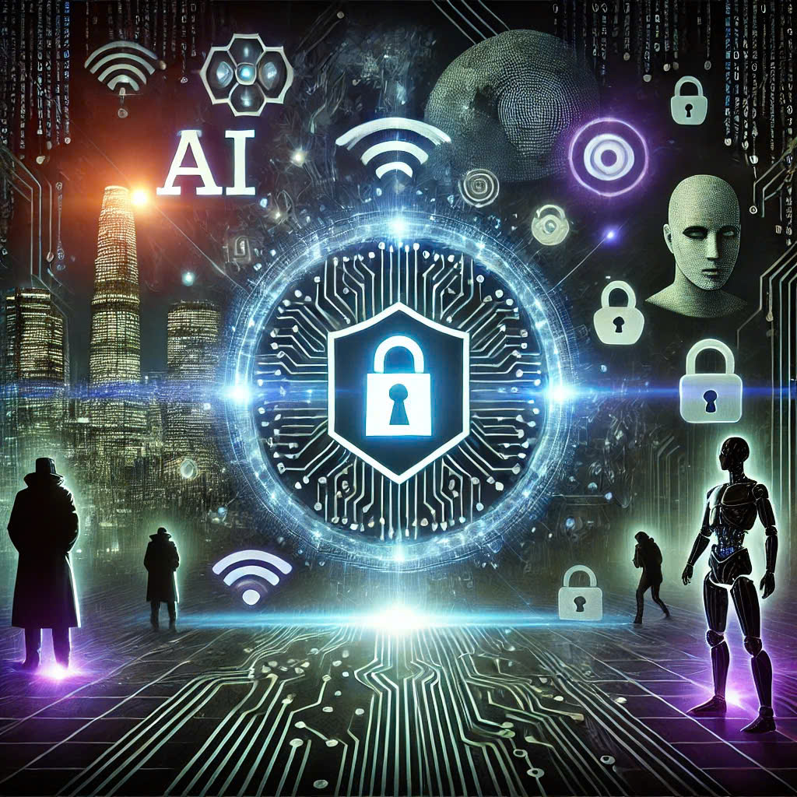

# ADVANTAGES OF AI TECHNOLOGY

**AI offers numerous advantages that significantly enhance our daily lives and various fields, from automating business processes to improving customer experiences. With its ability to analyze vast amounts of data, AI not only saves time and resources but also opens up new opportunities in research, healthcare, and technology. The advancement of AI is gradually transforming how we interact with the world, creating smarter and more efficient solutions to complex problems.**

## Improve Healthcare services.

AI can analyze medical data and provide more accurate diagnoses, helping doctors detect diseases early. AI applications in healthcare also personalize treatment methods, thereby improving patient health.

## Support Education and Research.

AI can help students learn more effectively by personalizing study content, automating grading, and providing tailored learning suggestions. In scientific research, AI assists in rapidly analyzing and processing large datasets, thereby accelerating the speed and quality of inventions and innovations.

## Promote the Economy and Industry 4.0.

AI is one of the key pillars of the Fourth Industrial Revolution, helping businesses grow through market data analysis, predicting consumer behavior, and creating new products tailored to customer needs.

## Cybersecurity and Crime prevention

AI can quickly detect and respond to cyberattacks, ensuring security for individuals and businesses. Additionally, AI systems in law enforcement help monitor, detect, and prevent crime through the analysis of visual data and behavior patterns.
